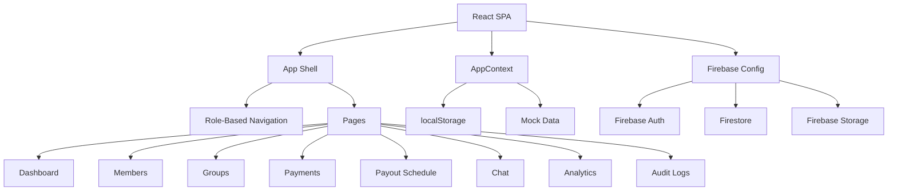
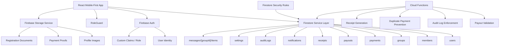
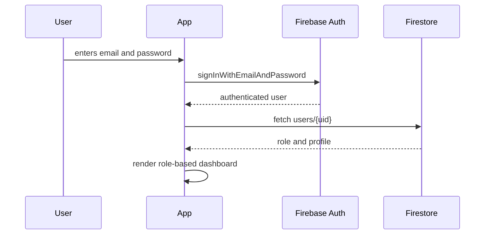
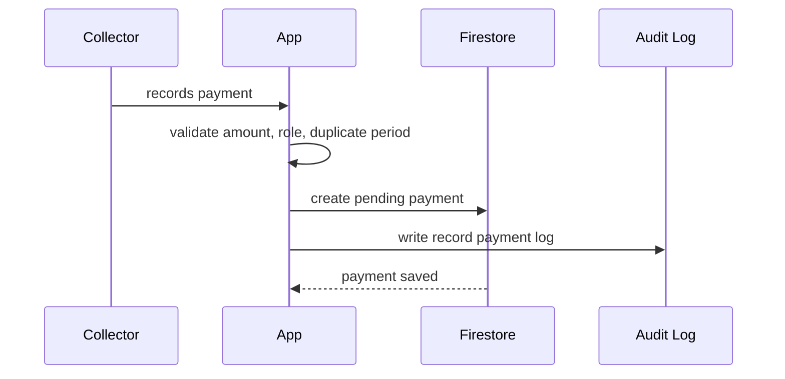
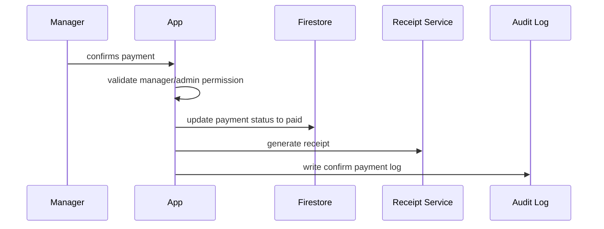

# Excellent Susu Architecture

## Purpose

Excellent Susu is a mobile-first Susu management and tracker app for savings groups, contributions, payouts, members, reminders, receipts, reports, chat, and audit logs.

The target architecture is a secure fintech-style React and Firebase system that supports four roles:

- Super Admin
- Manager
- Collector
- Member

The app must protect financial records, enforce role-based access, keep an audit trail, and avoid relying on local-only state for production data.

## Current Architecture

The current app is a React single-page application with Firebase initialized, but most business data still flows through local React state and `localStorage`.



### Current Frontend Modules

- `src/App.jsx`  
  Main app shell, page routing, role-based navigation, drawer, top bar, bottom navigation, profile drawer, and sign-out flow.

- `src/context/AppContext.jsx`  
  Central state provider for users, groups, payments, reminders, payout schedule, audit logs, and logged-in user.

- `src/pages/*`  
  Feature screens: dashboard, members, groups, payments, payouts, defaulters, reminders, chat, analytics, leaderboard, settings, and audit logs.

- `src/components/*`  
  Shared UI components such as icons, avatars, profile drawer, reusable fintech UI elements, and controls.

- `src/utils/*`  
  Helpers for Firebase setup, role access, audit entries, finance validation, formatting, receipts, and IDs.

- `src/data/mockData.js`  
  Demo data used as local fallback.

### Current Data Behavior

The following data is currently stored locally:

- users
- groups
- payments
- reminders
- payout schedule
- audit logs
- auth session fallback

This is useful for demo mode, but it is not production-safe for a financial app.

## Target Production Architecture

The production app should use Firebase as the source of truth, with the frontend acting as a secure client.



## Recommended Layers

### 1. Presentation Layer

Responsible for rendering screens and reusable UI components.

Recommended structure:

```text
src/
  components/
    shell/
      AppShell.jsx
      Header.jsx
      BottomNav.jsx
      SideDrawer.jsx
    ui/
      StatCard.jsx
      AlertCard.jsx
      ConfirmModal.jsx
      EmptyState.jsx
      LoadingState.jsx
    domain/
      GroupCard.jsx
      MemberCard.jsx
      PaymentCard.jsx
      PayoutCard.jsx
      ReceiptCard.jsx
      ChatBubble.jsx
      AuditLogItem.jsx
```

### 2. Feature Screen Layer

Each screen should focus on layout and user interaction, not raw Firebase logic.

Recommended structure:

```text
src/pages/
  Dashboard.jsx
  Members.jsx
  Groups.jsx
  Payments.jsx
  PayoutSchedule.jsx
  Defaulters.jsx
  Receipts.jsx
  Reports.jsx
  GroupChat.jsx
  Settings.jsx
  AuditLogs.jsx
```

### 3. Service Layer

All Firebase reads and writes should live in service files. Pages should call services, not Firestore directly.

Recommended structure:

```text
src/services/
  authService.js
  userService.js
  memberService.js
  groupService.js
  paymentService.js
  payoutService.js
  receiptService.js
  chatService.js
  notificationService.js
  auditService.js
  storageService.js
```

### 4. Validation Layer

Financial and security rules should be reusable and tested.

Recommended structure:

```text
src/validation/
  paymentRules.js
  payoutRules.js
  memberRules.js
  groupRules.js
  authRules.js
```

### 5. Security Layer

Frontend role checks improve UX, but Firestore rules and backend validation must enforce real protection.

Recommended structure:

```text
src/security/
  RoleGuard.jsx
  permissions.js
  firestoreRules.example.rules
```

## Firestore Collections

### users

Stores app users and staff accounts.

```js
users/{userId} = {
  fullName,
  email,
  phone,
  role, // superAdmin | manager | collector | member
  status, // active | suspended | archived
  assignedGroups,
  createdAt,
  updatedAt
}
```

### members

Stores member profile and Susu participation information.

```js
members/{memberId} = {
  fullName,
  phone,
  email,
  address,
  groupId,
  role,
  status,
  contributionAmount,
  paymentFrequency,
  joinedAt,
  createdBy,
  updatedAt
}
```

### groups

Stores Susu group setup and payout structure.

```js
groups/{groupId} = {
  groupName,
  contributionAmount,
  frequency,
  totalSlots,
  currentRound,
  startDate,
  endDate,
  status,
  members,
  payoutOrder,
  createdBy,
  createdAt,
  updatedAt
}
```

### payments

Stores every contribution record.

```js
payments/{paymentId} = {
  memberId,
  groupId,
  amount,
  method,
  status, // paid | pending | overdue | rejected
  paymentDate,
  dueDate,
  recordedBy,
  confirmedBy,
  proofUrl,
  receiptNumber,
  notes,
  createdAt,
  updatedAt
}
```

### payouts

Stores payout schedule and payout status.

```js
payouts/{payoutId} = {
  groupId,
  memberId,
  payoutAmount,
  scheduledDate,
  status, // scheduled | completed | delayed | cancelled
  paidAt,
  approvedBy,
  notes
}
```

### receipts

Stores confirmed payment receipts.

```js
receipts/{receiptId} = {
  receiptNumber,
  paymentId,
  memberId,
  groupId,
  amount,
  paymentMethod,
  paymentDate,
  status,
  recordedBy,
  confirmedBy,
  createdAt
}
```

### messages

Stores group chat messages by group.

```js
messages/{groupId}/items/{messageId} = {
  senderId,
  senderName,
  senderRole,
  message,
  attachmentUrl,
  createdAt,
  status
}
```

### auditLogs

Stores sensitive system events.

```js
auditLogs/{logId} = {
  action,
  actorId,
  actorName,
  actorRole,
  targetType,
  targetId,
  oldValue,
  newValue,
  timestamp,
  deviceInfo
}
```

## Role Permissions

### Super Admin

Can:

- create, edit, archive users
- create, edit, archive groups
- approve payments
- manage payouts
- view all reports
- view audit logs
- manage settings

### Manager

Can:

- manage assigned groups
- add and update members
- verify payments
- manage payouts for assigned groups
- view assigned group reports

### Collector

Can:

- view assigned members
- record payments
- upload payment proof
- send reminders
- view own collection reports

### Member

Can:

- view own contribution records
- view own group details
- view own receipts
- chat in assigned group
- receive notifications

## Financial Rules

The system must enforce these rules before saving financial records:

- Payment amount must match the group contribution amount unless an authorized admin override is recorded.
- A member cannot have two paid records for the same group and due period.
- Confirmed payments cannot be edited by collectors.
- Every confirmed payment must generate a receipt.
- Payouts should not be marked completed unless required payments are verified or an authorized override is logged.
- Financial records should not be deleted; use `archived`, `rejected`, or `cancelled` statuses.

## Report Formulas

Use these formulas consistently:

```text
collectionRate = totalPaid / totalExpected * 100
defaultRate = overduePayments / totalExpectedPayments * 100
outstanding = expected - paid
netPosition = totalCollected - totalPaidOut
groupCompletionRate = currentRound / totalSlots * 100
expectedPoolPerRound = contributionAmount * memberCount
expectedFullCyclePool = contributionAmount * memberCount * totalSlots
```

## Security Requirements

The production version must:

- use Firebase Authentication
- read roles from trusted Firebase user records or custom claims
- enforce role access in Firestore security rules
- validate role before rendering pages
- validate role again before writes
- sanitize user input
- avoid raw Firebase errors in the UI
- avoid secrets in frontend code
- store uploaded files in Firebase Storage
- use server timestamps for financial records
- write audit logs for all sensitive actions
- prevent duplicate payments
- prevent unauthorized edits to confirmed payments
- avoid deleting financial records

## Data Flow

### Login



### Record Payment



### Confirm Payment



## Migration Plan

### Phase 1: Stabilize Demo App

- Keep current UI working.
- Keep mock/localStorage fallback.
- Fix critical validation, IDs, duplicate payments, role navigation, and obvious UI issues.

### Phase 2: Introduce Firebase Services

- Create service files for users, groups, payments, payouts, receipts, messages, and audit logs.
- Move reads and writes out of `AppContext`.
- Keep localStorage only for demo/offline fallback.

### Phase 3: Firestore Source of Truth

- Replace mock data with Firestore listeners.
- Store profile images and payment proof in Firebase Storage.
- Use server timestamps.
- Generate receipts after confirmed payments.

### Phase 4: Security Hardening

- Add strict Firestore rules.
- Add role-based custom claims or trusted user role records.
- Add Cloud Functions for financial validation where frontend-only enforcement is not enough.
- Add audit logs for every sensitive write.

### Phase 5: Production Readiness

- Add loading skeletons and error states.
- Add analytics derived from real Firestore data.
- Test all roles.
- Test mobile, tablet, and desktop layouts.
- Review accessibility and color contrast.
- Add backup/export strategy for financial records.

## Manual Testing Checklist

- Login as Super Admin
- Login as Manager
- Login as Collector
- Login as Member
- Create group
- Edit group
- Add member
- Assign member to group
- Record payment
- Confirm payment
- Reject payment
- Prevent duplicate payment
- Generate receipt
- Upload profile image
- Upload payment proof
- Detect overdue payment
- Send reminder
- Complete payout
- Send chat message
- View reports
- View audit logs
- Open sidebar on mobile
- Use bottom navigation on mobile
- Test tablet layout
- Test sign-out modal
